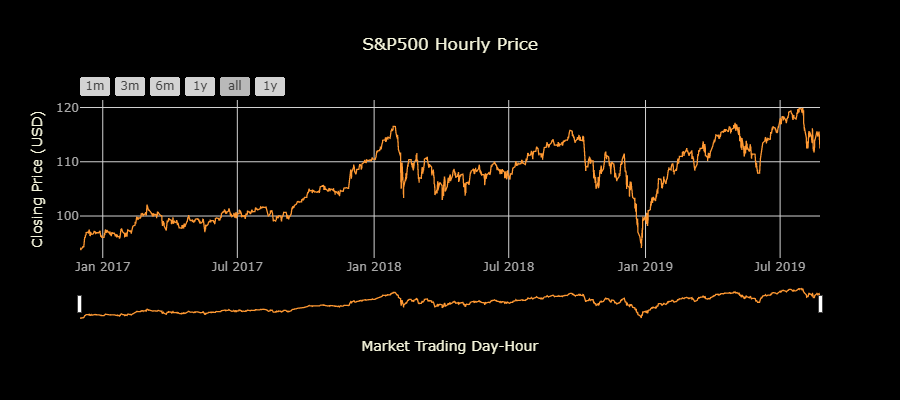
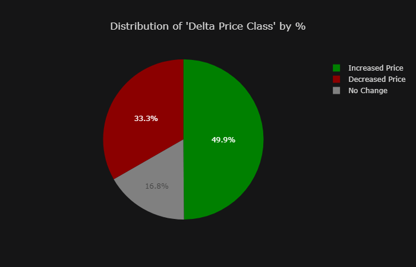
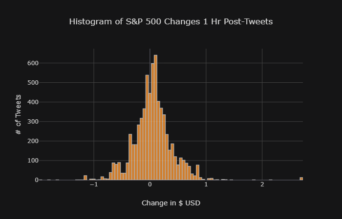
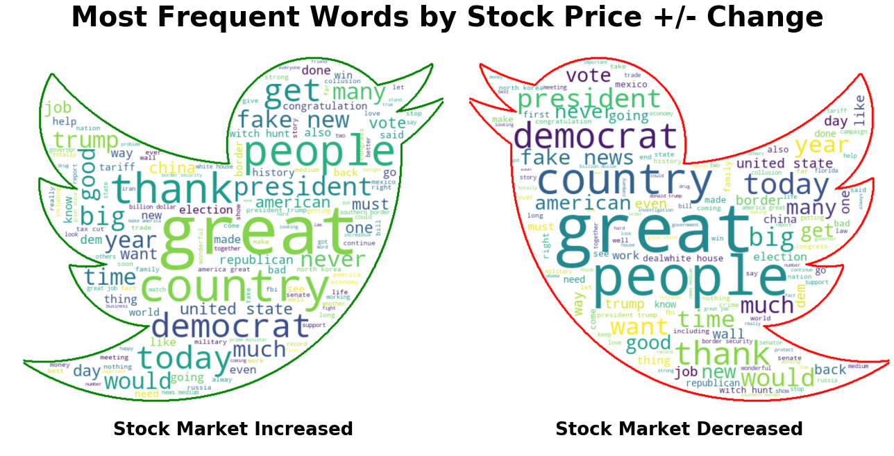
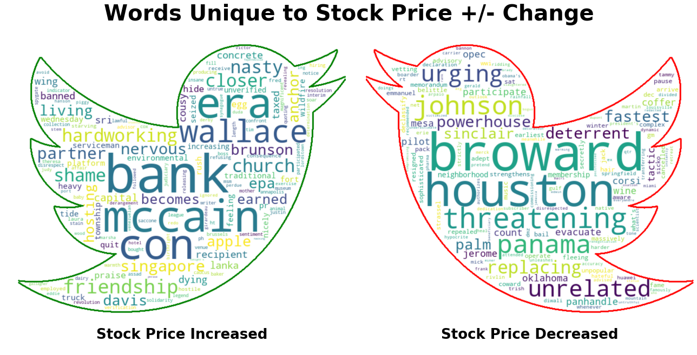
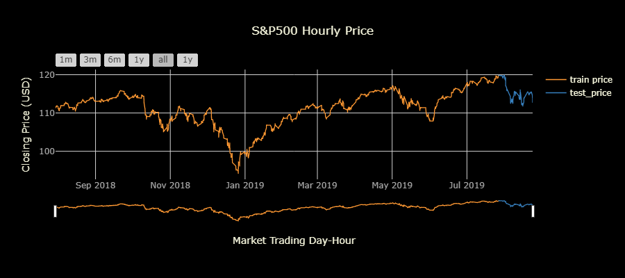
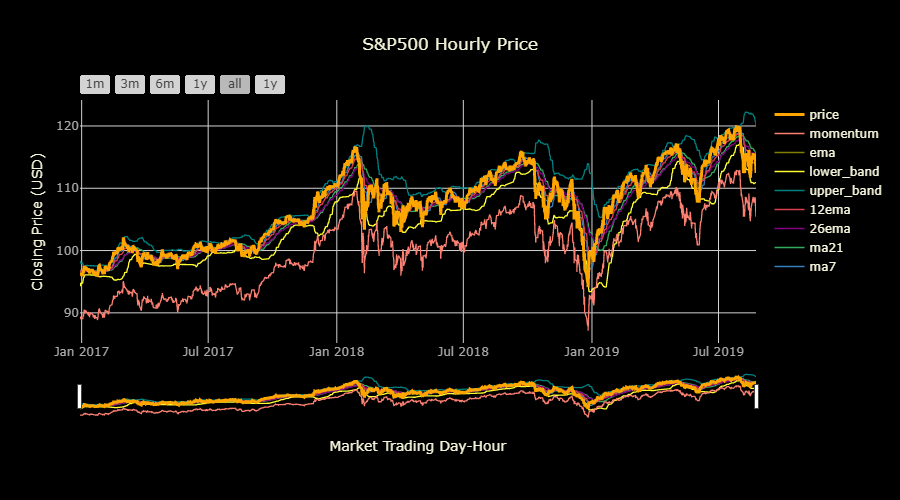
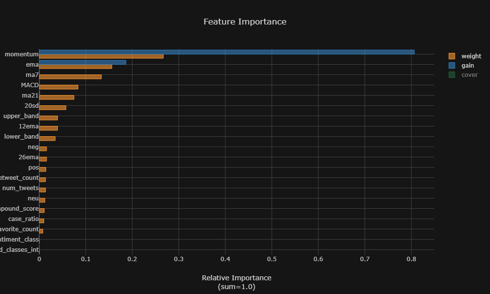

# ABSTRACT:

> Stock Market prices are notoriously difficult to model, but advances in machine learning algorithms in recent years provide renewed possibilities in accurately modeling market performance. One notable addition in modern machine learning is that of Natural Language Processing (NLP). For those modeling a specific stock, performing NLP feature extraction and analysis on the collection of news headlines, shareholder documents, or social media postings that mention the company can provide additional information about the human/social elements to predicting market behaviors. These insights could not be captured by historical price data and technical indicators alone.

> President Donald J. Trump is one of the most prolific users of social media, specifically Twitter, using it as a direct messaging channel to his followers, avoiding the traditional filtering and restriction that normally controls the public influence of the President of the United States. An additional element of the presidency that Trump has avoided is that of financial transparency and divesting of assets. Historically, this is done in order to avoid conflicts of interest, apparent or actual. The president is also known to target companies directly with his Tweets, advocating for specific changes/decisions by the company, or simply airing his greivances. This leads to the natural question, how much influence *does* President Trump exert over the financial markets? 

> To explore this question, we built multiple types of models attempting to answer this question, using the S&P500 as our market index. First, we built a classification model to predict the change in stock price 60 mins after the tweet. We trained Word2Vec embeddings on President Trump's tweets since his election, which we used as the embedding layer for LSTM and GRU neural networks. 

> We next build a baseline time series regression model, using historical price data alone to predict price by trading-hour. We then built upon this, adding several technical indicators of market performance as additional features. 
Finally, we combined the predicitons of our classification model, as well as several other metrics about the tweets (sentiment scores, # of retweets/favorites, upper-to-lowercase ratio,etc.) to see if combining all of these sources of information could explain even more of the variance in stock market prices. 


## THE BIG QUESTION:
> #### **Can the Twitter activity of Donald Trump explain fluctuations in the stock market?**

<br>
<br>

**We will use a combination of traditional stock market forecasting combined with Natural Language Processing and word embeddings from President Trump's tweets to predict fluctuations in the stock market (using S&P 500 as index).**

### **Question 1: Can we predict if stock prices will go up or down at a fixed time point, based on the language in Trump's tweets?**
- Train Word2Vec embeddings using negative sampling to focus on less frequently used words
- Classification models predicting `delta_price`(positive/negative change in stock price) class 60 mins post-tweet 
- Use trained vectors in a Keras EmbeddingLayer as input to Recurrent Neural Networks:
    - Model 0A:
        - LSTM classification neural network 
    - Model 0B:
        - GRU classification neural network


### **Question 2: How well can explain stock market fluctuations using only historical price data?**
- Model 1
    - LSTM Neural Network predicting future price based on historical **price data alone**.

### **Question 3: Does adding technical market indicators to our model improve its ability to predict stock prices?**
- Model 2<br><br>
    - LSTM Neural Network predicitng price based on **stock price + stock market technical indicators**

### Question 4: If we add the NLP analysis of Donald Trump's Tweets to our data from Model 2 (stock price + technical indicators), can we better predict the S&P500 price?

- **FEATURES:**
    - Start with all market data from Model 2
    - Add tweet NLP predictions from Model 0 from the previous hour's tweets combined. 
    - Calculate additional features about Trump's Tweets:
        - Perform sentiment analysis scores using NLTK and Vader
        - favorite/retweet counts
        - upper-to-lowercase ratio 
        - tweet frequency

- **MODELS:**
    - Model 3:
        - LSTM Neural Network
    - Model X:
        - XGBoost Decision Tree Regressor


# SUMMARY 

## TWITTER DATA - CLASSIFICATION MODEL

**Trained Word2Vec embeddings on collection of Donal Trump's Tweets.**
- Used negative skip-gram method and negative sampling to best represent infrequently used words.
    

**Classified tweets based on change in stock price (delta_price)**
- Calculated price change from time of tweet to 60 mins later.
    - "No Change" if the delta price was < \$0.05 
    - "Increase" if delta price was >+\$0.05
    - "Decrease if delta price was >-\$0.05
    
*NOTE: This model's predictions will become a feature in our final model.*



### TWEET NLP BY `delta_price` CLASS
- There are many overlapping most frequent words for pos/neg classes. Therefore should shift Word2Vec sampling strategy to using negative sampling to give *less frequent* words more weight.  



- If we eliminate overlapping words, we can start to see the differences.


### Using Word2Vec Emnbeddings to Predict each tweet's `delta_price` 
 


## STOCK MARKET (S&P 500) DATA :
### TIME SERIES FORECASTING USING MARKET DATA

#### **Model 1: Use price alone to forecast hourly price.**


- LSTM Neural Network


    


#### **Model 2: Use price combined with technical indicators.**

- **Calculate 7 technical indicators from S&P 500 hourly closing price.**
    * [x] 7 days moving average 
    * [x] 21 days moving average
    * [x] exponential moving average
    * [x] momentum
    * [x] Bollinger bands
    * [x] MACD
  



### MODEL 3: COMBINING STOCK MARKET DATA, NLP CLASSIFICATION, AND OTHER TWEET METRICS

- **FEATURES FOR FINAL MODEL:**<br><br>
    - **Stock Data:**
        * [x] 7 days moving average 
        * [x] 21 days moving average
        * [x] exponential moving average
        * [x] momentum
        * [x] Bollinger bands
        * [x] MACD<br><br>

    - **Tweet Data:**
        * [x] 'delta_price' prediction classification for body of tweets from prior hour (model 0)
        * [x] Number of tweets in hour
        * [x] Ratio of uppercase:lowercase ratio (case_ratio)
        * [x] Total # of favorites for the tweets
        * [x] Total # of retweets for the tweets
        * [x] Sentiment Scores:
            - [x] Individual negative, neutral, and positive sentiment scores
            - [x] Compound Sentiment Score (combines all 3)
            - [x] sentiment class (+/- compound score)    


### FINAL MODEL, PART X
- Decided to move away from neural networks for some XGBoost Regression Trees
- [X] XGBREgression





# ANALYSIS DETAILS

## OBTAIN

* **All Donald Trump tweets from 12/01/2016 (pre-inaugaration day) to end of 08/23/2018**
    - Extracted from http://www.trumptwitterarchive.com/

* **Minute-resolution data for the S&P500 covering the same time period.**
    - IVE S&P500 Index from - http://www.kibot.com/free_historical_data.aspx
        
NOTE: Both sources required manual extraction and both 1-min historical stock data and batch-historical-tweet data are difficult to obtain without paying \$150-\$2000 monthly developer memberships. 

## SCRUB
### Tweet Natural Language Processing

To prepare Donal Trump's tweets for modeling, **it is essential to preprocess the text** and simplify its contents.
<br><br>
1. **At a minimum, things like:**
    - punctuation
    - numbers
    - upper vs lowercase letters<br>
    ***must*** be addressed before any initial analyses. I refer tho this initial cleaning as **"minimal cleaning"** of the text content<br>
    
> Version 1 of the tweet processing removes these items, as well as the removal of any urls in a tweet. The resulting data column is referred to here as "content_min_clean".

<br><br>
2. It is **always recommended** that go a step beyond this and<br> remove **commonly used words that contain little information** <br>for our machine learning algorithms. Words like: (the,was,he,she, it,etc.)<br> are called **"stopwords"**, and it is critical to address them as well.

> Version 2 of the tweet processing removes these items and the resulting data column is referred here as `cleaned_stopped_content`

<br>

3. Additionally, many analyses **need the text tokenzied** into a list of words<br> and not in a natural sentence format. Instead, they are a list of words (**tokens**) separated by ",", which tells the algorithm what should be considered one word.<br><br>For the tweet processing, I used a version of tokenization, called `regexp_tokenziation` <br>which uses pattern of letters and symbols (the `expression`) <br>that indicate what combination of alpha numeric characters should be considered a single token.<br><br>The pattern I used was `"([a-zA-Z]+(?:'[a-z]+)?)"`, which allows for words such as "can't" that contain "'" in the middle of word. This processes was actually applied in order to process Version 1 and 2 of the Tweets, but the resulting text was put back into sentence form. 

> Version 3 of the tweets keeps the text in their regexp-tokenized form and is reffered to as `cleaned_stopped_tokens`
<br>

4. While not always required, it is often a good idea to reduce similar words down to a shared core.
There are often **multiple variants of the same word with the same/simiar meaning**,<br> but one may plural **(i.e. "democrat" and "democrats")**, or form of words is different **(i.e. run, running).**<br> Simplifying words down to the basic core word (or word *stem*) is referred to as **"stemming"**. <br><br> A more advanced form of this also understands things like words that are just in a **different tense** such as  i.e.  **"ran", "run", "running"**. This process is called  **"lemmatization**, where the words are reduced to their simplest form, called "**lemmas**"<br>  
> Version 4 of the tweets are all reduced down to their word lemmas, futher aiding the algorithm in learning the meaning of the texts.


#### EXAMPLE TWEETS AND PROCESSING STEPS:
**TWEET FROM 08-25-2017 12:25:10:**
* **["content"] column:**<p><blockquote>***"Strange statement by Bob Corker considering that he is constantly asking me whether or not he should run again in '18. Tennessee not happy!"***
* **["content_min_clean"] column:**<p><blockquote>***"strange statement by bob corker considering that he is constantly asking me whether or not he should run again in  18  tennessee not happy "***
* **["cleaned_stopped_content"] column:**<p><blockquote>***"strange statement bob corker considering constantly asking whether run tennessee happy"***
* **["cleaned_stopped_tokens"] column:**<p><blockquote>***"['strange', 'statement', 'bob', 'corker', 'considering', 'constantly', 'asking', 'whether', 'run', 'tennessee', 'happy']"***
* **["cleaned_stopped_lemmas"] column:**<p><blockquote>***"strange statement bob corker considering constantly asking whether run tennessee happy"***


### Stock Market Data and Indicators
- Time frequency conversion to Custom Business Hours adjusted to NYSE market hours.
- Calculaton of technical indicators using price data.

#### Technical Indicator Calculation
1. **7 and 21 day moving averages**
```python
df['ma7'] df['price'].rolling(window = 7 ).mean() #window of 7 if daily data
df['ma21'] df['price'].rolling(window = 21).mean() #window of 21 if daily data
```    
2. **MACD(Moving Average Convergence Divergence)**

> Moving Average Convergence Divergence (MACD) is a trend-following momentumindicator that shows the relationship between two moving averages of a security’s price. The MACD is calculated by subtracting the 26-period Exponential Moving Average (EMA) from the 12-period EMA.

>The result of that calculation is the MACD line. A nine-day EMA of the MACD, called the "signal line," is then plotted on top of the MACD line, which can function as a trigger for buy and sell signals. 

> Traders may buy the security when the MACD crosses above its signal line and sell - or short - the security when the MACD crosses below the signal line. Moving Average Convergence Divergence (MACD) indicators can be interpreted in several ways, but the more common methods are crossovers, divergences, and rapid rises/falls.  - _[from Investopedia](https://www.investopedia.com/terms/m/macd.asp)_

```python
df['ewma26'] = pd.ewma(df['price'], span=26)
df['ewma12'] = pd.ewma(df['price'], span=12)
df['MACD'] = (df['12ema']-df['26ema'])
```
3. **Exponentially weighted moving average**
```python
dataset['ema'] = dataset['price'].ewm(com=0.5).mean()
```

4. **Bollinger bands**
    > "Bollinger Bands® are a popular technical indicators used by traders in all markets, including stocks, futures and currencies. There are a number of uses for Bollinger Bands®, including determining overbought and oversold levels, as a trend following tool, and monitoring for breakouts. There are also some pitfalls of the indicators. In this article, we will address all these areas."
> Bollinger bands are composed of three lines. One of the more common calculations of Bollinger Bands uses a 20-day simple moving average (SMA) for the middle band. The upper band is calculated by taking the middle band and adding twice the daily standard deviation, the lower band is the same but subtracts twice the daily std. - _[from Investopedia](https://www.investopedia.com/trading/using-bollinger-bands-to-gauge-trends/)_

    - Boilinger Upper Band:<br>
    $BOLU = MA(TP, n) + m * \sigma[TP, n ]$<br><br>
    - Boilinger Lower Band<br>
    $ BOLD = MA(TP,n) - m * \sigma[TP, n ]$
    - Where:
        - $MA$  = moving average
        - $TP$ (typical price) = $(High + Low+Close)/ 3$
        - $n$ is number of days in smoothing period
        - $m$ is the number of standard deviations
        - $\sigma[TP, n]$ = Standard Deviations over last $n$ periods of $TP$

```python
# Create Bollinger Bands
dataset['20sd'] = pd.stats.moments.rolling_std(dataset['price'],20)
dataset['upper_band'] = dataset['ma21'] + (dataset['20sd']*2)
dataset['lower_band'] = dataset['ma21'] - (dataset['20sd']*2)
```


5. **Momentum**
> "Momentum is the rate of acceleration of a security's price or volume – that is, the speed at which the price is changing. Simply put, it refers to the rate of change on price movements for a particular asset and is usually defined as a rate. In technical analysis, momentum is considered an oscillator and is used to help identify trend lines." - _[from Investopedia](https://www.investopedia.com/articles/technical/081501.asp)_

    - $ Momentum = V - V_x$
    - Where:
        - $ V $ = Latest Price
        - $ V_x $ = Closing Price
        - $ x $ = number of days ago

```python
# Create Momentum
dataset['momentum'] = dataset['price']-1
```

## EXPLORE
- See [SUMMARY](#SUMMARY) Section

## MODELING

### Choosing Appropriate Metrics for Time Series Forecasting

- Due to the estimation of price being a precise regression, accuracy will not be an appropriate metric for judging model performance. 
 - e.g. if the price was \\$ 114.23 and our model predicted \\$ 114.25, our accuracy is 0.<br><br>

- **Thiel's U:**
    - [Source of Equation/Explanation of Metric](https://docs.oracle.com/cd/E57185_01/CBREG/ch06s02s03s04.html)
    -  U = \sqrt{\frac{\sum_{t=1 }^{n-1}\left(\frac{\bar{Y}_{t+1} - Y_{t+1}}{Y_t}\right)^2}{\sum_{t=1 }^{n-1}\left(\frac{Y_{t+1} - Y_{t}}{Y_t}\right)^2}}$


|Thiel's U Value | Interpretation |
| --- | --- |
| <1 | Forecasting is better than guessing| 
| 1 | Forecasting is about as good as guessing| 
|>1 | Forecasting is worse than guessing|

## TO DO
- Add results tables from each model 
### Model 0A: NLP Classification - LSTM
```
_________________________________________________________________
Layer (type)                 Output Shape              Param #   
=================================================================
embedding_1 (Embedding)      (None, 35, 300)           1565100   
_________________________________________________________________
bidirectional_1 (Bidirection (None, 200)               320800    
_________________________________________________________________
dense_1 (Dense)              (None, 3)                 603       
=================================================================
Total params: 1,886,503
Trainable params: 321,403
Non-trainable params: 1,565,100
_________________________________________________________________
```
#### Model 0A Results

### Model 0B: NLP Classification - GRU
```
_________________________________________________________________
Layer (type)                 Output Shape              Param #   
=================================================================
embedding_2 (Embedding)      (None, 35, 300)           1565100   
_________________________________________________________________
spatial_dropout1d_1 (Spatial (None, 35, 300)           0         
_________________________________________________________________
gru_1 (GRU)                  (None, 35, 100)           120300    
_________________________________________________________________
gru_2 (GRU)                  (None, 100)               60300     
_________________________________________________________________
dense_2 (Dense)              (None, 3)                 303       
=================================================================
Total params: 1,746,003
Trainable params: 180,903
Non-trainable params: 1,565,100
_________________________________________________________________
```

#### Model 0B Results

### Model 1: S&P500 Price Regression from Price Only

```
_________________________________________________________________
Layer (type)                 Output Shape              Param #   
=================================================================
lstm_2 (LSTM)                (None, 7, 50)             10400     
_________________________________________________________________
lstm_3 (LSTM)                (None, 50)                20200     
_________________________________________________________________
dense_3 (Dense)              (None, 1)                 51        
=================================================================
Total params: 30,651
Trainable params: 30,651
Non-trainable params: 0
_________________________________________________________________
```

#### Model 1 Results

### Model 2: S&P500 Price Regression from Price + Technical Indicators

```
_________________________________________________________________
Layer (type)                 Output Shape              Param #   
=================================================================
lstm_4 (LSTM)                (None, 7, 50)             12400     
_________________________________________________________________
lstm_5 (LSTM)                (None, 50)                20200     
_________________________________________________________________
dense_4 (Dense)              (None, 1)                 51        
=================================================================
Total params: 32,651
Trainable params: 32,651
Non-trainable params: 0
_________________________________________________________________
```

#### Model 2 Results

### Model 3: S&P500 Price Regression - Usng Twitter NLP + Price + Technical Indicators

```
_________________________________________________________________
Layer (type)                 Output Shape              Param #   
=================================================================
lstm_6 (LSTM)                (None, 14, 100)           48800     
_________________________________________________________________
lstm_7 (LSTM)                (None, 100)               80400     
_________________________________________________________________
dense_5 (Dense)              (None, 1)                 101       
=================================================================
Total params: 129,301
Trainable params: 129,301
Non-trainable params: 0
_________________________________________________________________
```
#### Model 3 Results


### Model X: S&P500 Price XGBoost Regression - Usng Twitter NLP + Price + Technical Indicators


## iNTERPRETATION 
### Delta-Stock-Price NLP Models
GRU performed better than LSTM and was better than guessing.
#### Future Directions:
* For NLP Classification:
    - Use GloVe Pre-trained twitter vectors in lieu of training Word2Vec on dataset. 
    - Futher tweak the negative sampling parameters for the Word2Vec modeling. 
    - Try other time periods for delta_price calculatin (30, 45, 75 min, etc)
     
* For Time Series Forecasting:
    - Implement Cross Validation using custom version of Sklearn TimeSeriesSplitter
    - 

    
### REFERENCES / INSPIRATION:

1. **Stanford Scientific Poster Using NLP ALONE to predict if stock prices increase or decrease 5 mins after Trump tweets.**  
    - [Poster PDF LINK](http://cs229.stanford.edu/proj2017/final-posters/5140843.pdf)
    - Best accuracy was X, goal 1 is to create a classifier on a longer timescale with superior results.
    

2. **TowardsDataScience Blog Plost on "Using the latest advancements in deep learning to predict stock price movements."** 
     - [Blog Post link](https://towardsdatascience.com/aifortrading-2edd6fac689d)

